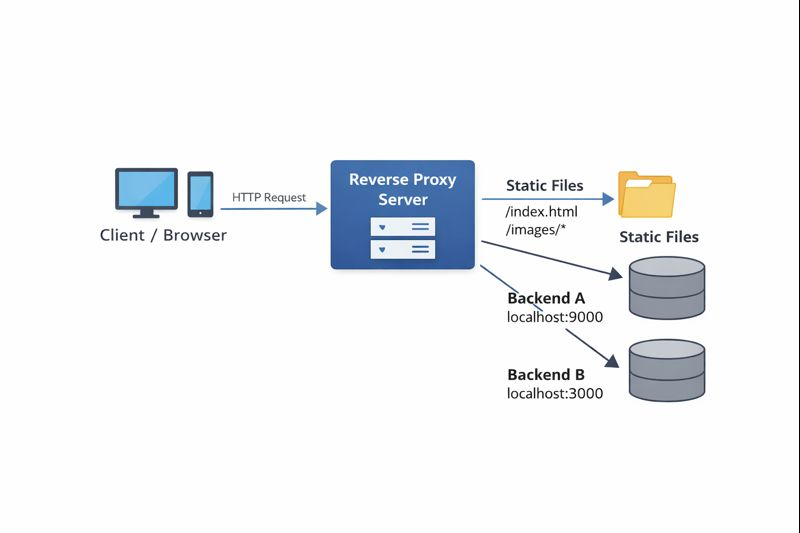

# Web Server in GO

A web server written in Go that supports static file serving and reverse proxying.


---



---

## Features

- Listen on a configurable port
- Serve static files (optional)
- Reverse proxy to one or more backends

---

## Run

```bash
go run .
```

---

## Configuration File

Example `config.conf`:

```conf
listen 8080
root ./static

proxy /api localhost:9000
proxy /proxy localhost:3000
```

---

## Direct Reverse Proxy Only

If you do not want to serve static files and only want to forward traffic:

```conf
listen 8080

proxy / localhost:9000
```

All incoming requests will be forwarded to `localhost:9000`.

---

## Testing

```bash
curl http://localhost:8080/
curl http://localhost:8080/api
```

---

## Project Structure

```
.
├── main.go
├── server.go
├── proxy.go
├── go.mod
├── utils.go
├── config.go
├── config.conf
├── static.go
├── README.md
└── static/
    └── index.html
```

---

## Notes

- Static file serving is optional
- If `root` is not defined, only proxy routes are used
- If no route matches, the server returns `404 Not Found`

---
